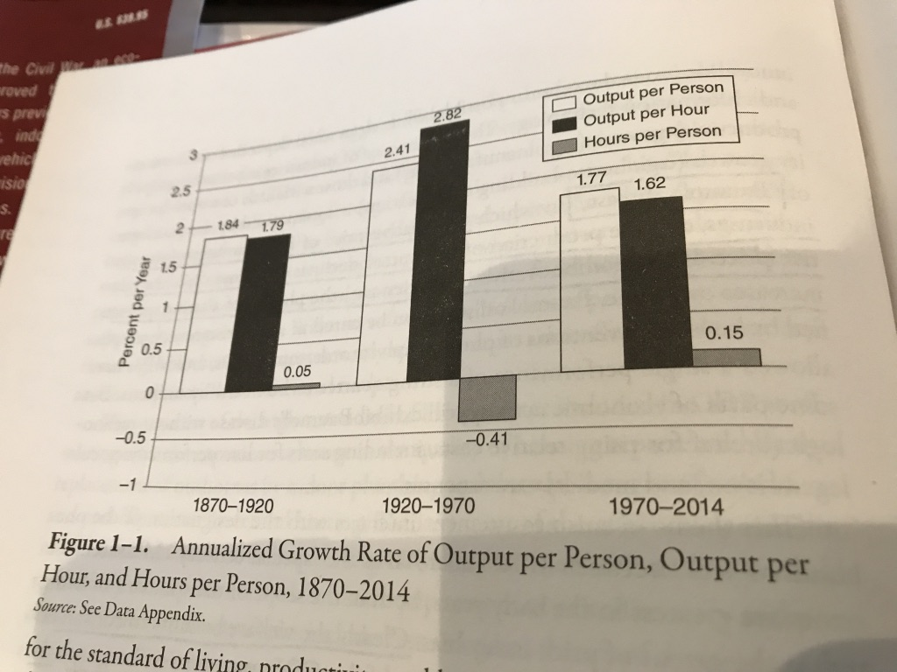
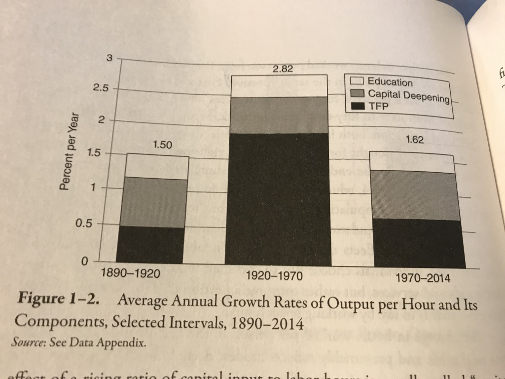
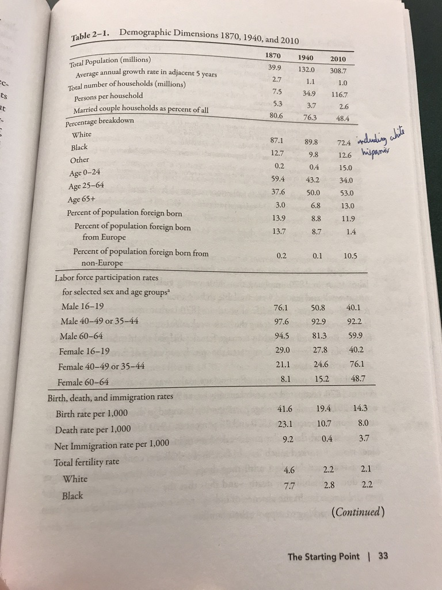
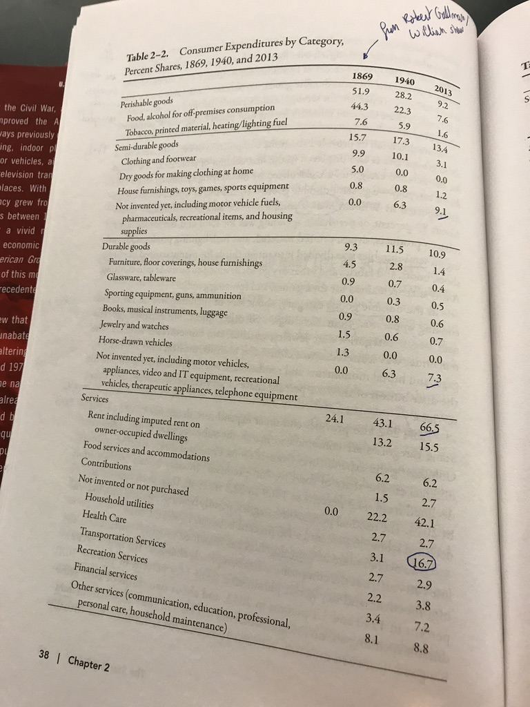

* 
* 
* 
* 
* # A text slide
  This is a demo of the [Jekyll Gallery](http://lexoyo.me/jekyll-slideshow/).
  
  Pictures from [this album](https://unsplash.com/collections/curated/93) by [Ben Blumenfeld](http://designerfund.com).

